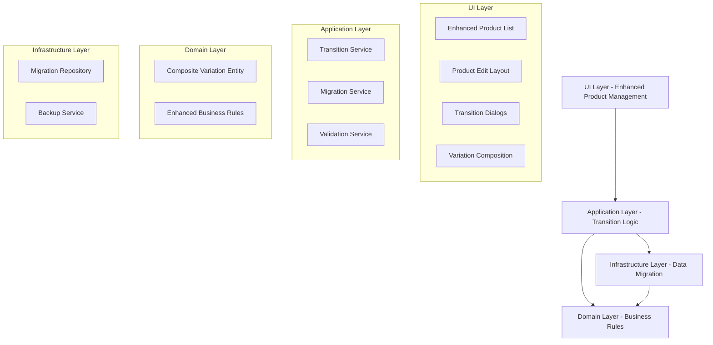

# Product Adjustments Design Document

## Overview

This document outlines the technical design for improving the Product Management System's handling of composite products with variations. The design focuses on creating intuitive user workflows, protecting data integrity, and providing clear feedback for potentially destructive operations.

## Architecture Overview

### High-Level Component Structure



## Component Design

### 1. Enhanced Product List Component

```typescript
interface EnhancedProductListProps {
  products: Product[];
  onProductEdit: (sku: string) => void;
  onProductDelete: (sku: string) => void;
  loading?: boolean;
}

interface DynamicColumn {
  key: keyof Product | 'actions';
  label: string;
  visible: (products: Product[]) => boolean;
  render?: (product: Product) => ReactNode;
  sortable?: boolean;
  width?: string;
}

const EnhancedProductList: React.FC<EnhancedProductListProps> = ({
  products,
  onProductEdit,
  onProductDelete,
  loading = false
}) => {
  // Dynamic column visibility based on product data
  const visibleColumns = useMemo(() => {
    return columns.filter(col => col.visible(products));
  }, [products]);

  // Responsive table with conditional columns
  return (
    <div className="space-y-4">
      <ProductListHeader 
        totalCount={products.length}
        compositeCount={products.filter(p => p.isComposite).length}
        variationCount={products.filter(p => p.hasVariation).length}
      />
      
      <AccessibleTable
        data={products}
        columns={visibleColumns}
        loading={loading}
        emptyMessage="No products found"
        onRowClick={onProductEdit}
      />
    </div>
  );
};
```

### 2. Transition Dialog System

```typescript
type TransitionType = 
  | 'enable-variations' 
  | 'disable-composite' 
  | 'disable-variations'
  | 'enable-composite';

interface TransitionDialogProps {
  open: boolean;
  type: TransitionType;
  productName: string;
  existingDataCount: number;
  onConfirm: () => Promise<void>;
  onCancel: () => void;
  loading?: boolean;
}

interface TransitionConfig {
  title: string;
  description: string;
  warning: string;
  confirmText: string;
  cancelText: string;
  destructive: boolean;
  requiresConfirmation: boolean;
  icon: ReactNode;
}

const TransitionDialog: React.FC<TransitionDialogProps> = ({
  open,
  type,
  productName,
  existingDataCount,
  onConfirm,
  onCancel,
  loading = false
}) => {
  const [confirmationText, setConfirmationText] = useState('');
  const [hasConfirmed, setHasConfirmed] = useState(false);
  
  const config = getTransitionConfig(type, existingDataCount);
  
  const handleConfirm = async () => {
    if (config.requiresConfirmation && !hasConfirmed) {
      return;
    }
    
    try {
      await onConfirm();
    } catch (error) {
      // Error handling
    }
  };

  return (
    <Dialog open={open} onOpenChange={onCancel}>
      <DialogContent className="max-w-md">
        <DialogHeader>
          <div className="flex items-center gap-3">
            {config.icon}
            <DialogTitle>{config.title}</DialogTitle>
          </div>
          <DialogDescription className="text-left">
            {config.description}
          </DialogDescription>
        </DialogHeader>

        {config.warning && (
          <div className={cn(
            "rounded-md p-4 text-sm",
            config.destructive 
              ? "bg-red-50 text-red-800 border border-red-200"
              : "bg-yellow-50 text-yellow-800 border border-yellow-200"
          )}>
            <div className="flex items-start gap-2">
              <AlertTriangle className="h-4 w-4 mt-0.5 flex-shrink-0" />
              <div>
                <div className="font-medium mb-1">
                  {config.destructive ? 'Data Loss Warning' : 'Important Notice'}
                </div>
                <div>{config.warning}</div>
              </div>
            </div>
          </div>
        )}

        {config.requiresConfirmation && (
          <div className="space-y-3">
            <Label htmlFor="confirmation">
              Type "{productName}" to confirm:
            </Label>
            <Input
              id="confirmation"
              value={confirmationText}
              onChange={(e) => {
                setConfirmationText(e.target.value);
                setHasConfirmed(e.target.value === productName);
              }}
              placeholder={productName}
              className={cn(
                hasConfirmed && "border-green-500 focus:border-green-500"
              )}
            />
          </div>
        )}

        <DialogFooter>
          <Button
            variant="outline"
            onClick={onCancel}
            disabled={loading}
          >
            {config.cancelText}
          </Button>
          <Button
            variant={config.destructive ? "destructive" : "default"}
            onClick={handleConfirm}
            disabled={loading || (config.requiresConfirmation && !hasConfirmed)}
            className="min-w-[120px]"
          >
            {loading ? (
              <div className="flex items-center gap-2">
                <Loader2 className="h-4 w-4 animate-spin" />
                Processing...
              </div>
            ) : (
              config.confirmText
            )}
          </Button>
        </DialogFooter>
      </DialogContent>
    </Dialog>
  );
};
```

### 3. Enhanced Product Edit Layout

```typescript
interface ProductEditLayoutProps {
  product: Product;
  activeTab: string;
  onTabChange: (tab: string) => void;
  onBack: () => void;
  onSave: (data: UpdateProductData) => Promise<void>;
  hasUnsavedChanges: boolean;
  children: ReactNode;
}

const ProductEditLayout: React.FC<ProductEditLayoutProps> = ({
  product,
  activeTab,
  onTabChange,
  onBack,
  onSave,
  hasUnsavedChanges,
  children
}) => {
  const [showUnsavedWarning, setShowUnsavedWarning] = useState(false);
  const [pendingNavigation, setPendingNavigation] = useState<(() => void) | null>(null);

  // Handle navigation with unsaved changes
  const handleNavigation = useCallback((navigationFn: () => void) => {
    if (hasUnsavedChanges) {
      setPendingNavigation(() => navigationFn);
      setShowUnsavedWarning(true);
    } else {
      navigationFn();
    }
  }, [hasUnsavedChanges]);

  // Available tabs based on product configuration
  const availableTabs = useMemo(() => {
    const tabs = [
      { id: 'details', label: 'Details', icon: Settings, available: true },
    ];

    if (product.hasVariation) {
      tabs.push({
        id: 'variations',
        label: 'Variations',
        icon: Layers,
        available: true
      });
    }

    if (product.isComposite) {
      tabs.push({
        id: 'composition',
        label: product.hasVariation ? 'Variation Compositions' : 'Composition',
        icon: Package,
        available: true
      });
    }

    return tabs;
  }, [product.isComposite, product.hasVariation]);

  return (
    <div className="min-h-screen bg-gray-50">
      {/* Header with breadcrumb and actions */}
      <div className="bg-white border-b">
        <div className="max-w-7xl mx-auto px-4 sm:px-6 lg:px-8">
          <div className="flex items-center justify-between h-16">
            {/* Breadcrumb and back button */}
            <div className="flex items-center gap-4">
              <Button
                variant="ghost"
                size="sm"
                onClick={() => handleNavigation(onBack)}
                className="flex items-center gap-2"
              >
                <ArrowLeft className="h-4 w-4" />
                Back to Products
              </Button>
              
              <div className="text-sm text-muted-foreground">
                <span>Products</span>
                <ChevronRight className="h-4 w-4 inline mx-1" />
                <span className="font-medium text-foreground">
                  {product.name} ({product.sku})
                </span>
              </div>
            </div>

            {/* Save indicator and actions */}
            <div className="flex items-center gap-3">
              {hasUnsavedChanges && (
                <div className="flex items-center gap-2 text-sm text-amber-600">
                  <Circle className="h-2 w-2 fill-current" />
                  Unsaved changes
                </div>
              )}
              
              <Button
                onClick={() => onSave({})}
                disabled={!hasUnsavedChanges}
                className="min-w-[80px]"
              >
                Save
              </Button>
            </div>
          </div>
        </div>
      </div>

      {/* Tab navigation */}
      <div className="bg-white border-b">
        <div className="max-w-7xl mx-auto px-4 sm:px-6 lg:px-8">
          <Tabs value={activeTab} onValueChange={onTabChange}>
            <TabsList className="h-12 bg-transparent border-0 p-0">
              {availableTabs.map((tab) => (
                <TabsTrigger
                  key={tab.id}
                  value={tab.id}
                  className="h-12 px-4 rounded-none border-b-2 border-transparent data-[state=active]:border-primary data-[state=active]:bg-transparent"
                >
                  <tab.icon className="h-4 w-4 mr-2" />
                  {tab.label}
                </TabsTrigger>
              ))}
            </TabsList>
          </Tabs>
        </div>
      </div>

      {/* Content area */}
      <div className="max-w-7xl mx-auto px-4 sm:px-6 lg:px-8 py-8">
        {children}
      </div>

      {/* Unsaved changes warning dialog */}
      <UnsavedChangesDialog
        open={showUnsavedWarning}
        onSave={async () => {
          await onSave({});
          setShowUnsavedWarning(false);
          pendingNavigation?.();
          setPendingNavigation(null);
        }}
        onDiscard={() => {
          setShowUnsavedWarning(false);
          pendingNavigation?.();
          setPendingNavigation(null);
        }}
        onCancel={() => {
          setShowUnsavedWarning(false);
          setPendingNavigation(null);
        }}
      />
    </div>
  );
};
```

### 4. Variation-Based Composition Interface

```typescript
interface CompositeVariation {
  id: string;
  name: string;
  compositionItems: CompositionItem[];
  totalWeight: number;
  createdAt: Date;
  updatedAt: Date;
}

interface VariationCompositionManagerProps {
  product: Product;
  variations: CompositeVariation[];
  onVariationCreate: (name?: string) => Promise<void>;
  onVariationUpdate: (id: string, data: Partial<CompositeVariation>) => Promise<void>;
  onVariationDelete: (id: string) => Promise<void>;
  onCompositionItemAdd: (variationId: string, item: CreateCompositionItemData) => Promise<void>;
  onCompositionItemUpdate: (variationId: string, itemId: string, data: UpdateCompositionItemData) => Promise<void>;
  onCompositionItemDelete: (variationId: string, itemId: string) => Promise<void>;
}

const VariationCompositionManager: React.FC<VariationCompositionManagerProps> = ({
  product,
  variations,
  onVariationCreate,
  onVariationUpdate,
  onVariationDelete,
  onCompositionItemAdd,
  onCompositionItemUpdate,
  onCompositionItemDelete
}) => {
  const [activeVariationId, setActiveVariationId] = useState(variations[0]?.id);
  const [editingVariationId, setEditingVariationId] = useState<string | null>(null);
  const [newVariationName, setNewVariationName] = useState('');

  const activeVariation = variations.find(v => v.id === activeVariationId);

  const handleVariationRename = async (id: string, newName: string) => {
    await onVariationUpdate(id, { name: newName });
    setEditingVariationId(null);
  };

  const generateNextVariationName = () => {
    const existingNumbers = variations
      .map(v => v.name.match(/^Variation (\d+)$/)?.[1])
      .filter(Boolean)
      .map(Number)
      .sort((a, b) => a - b);
    
    let nextNumber = 1;
    for (const num of existingNumbers) {
      if (num === nextNumber) {
        nextNumber++;
      } else {
        break;
      }
    }
    
    return `Variation ${nextNumber}`;
  };

  return (
    <div className="space-y-6">
      {/* Variation Management Header */}
      <div className="flex items-center justify-between">
        <div>
          <h3 className="text-lg font-medium">Composition Variations</h3>
          <p className="text-sm text-muted-foreground">
            Each variation has its own unique composition of components
          </p>
        </div>
        
        <Button
          onClick={() => onVariationCreate(generateNextVariationName())}
          className="flex items-center gap-2"
        >
          <Plus className="h-4 w-4" />
          Add Variation
        </Button>
      </div>

      {/* Variation Tabs */}
      <div className="border rounded-lg">
        <div className="flex items-center border-b bg-gray-50 p-1">
          {variations.map((variation) => (
            <div
              key={variation.id}
              className={cn(
                "flex items-center gap-2 px-3 py-2 rounded cursor-pointer transition-colors",
                activeVariationId === variation.id
                  ? "bg-white shadow-sm border"
                  : "hover:bg-gray-100"
              )}
              onClick={() => setActiveVariationId(variation.id)}
            >
              {editingVariationId === variation.id ? (
                <Input
                  value={newVariationName}
                  onChange={(e) => setNewVariationName(e.target.value)}
                  onBlur={() => {
                    if (newVariationName.trim()) {
                      handleVariationRename(variation.id, newVariationName.trim());
                    } else {
                      setEditingVariationId(null);
                    }
                  }}
                  onKeyDown={(e) => {
                    if (e.key === 'Enter') {
                      e.currentTarget.blur();
                    } else if (e.key === 'Escape') {
                      setEditingVariationId(null);
                      setNewVariationName('');
                    }
                  }}
                  className="h-6 text-sm"
                  autoFocus
                />
              ) : (
                <>
                  <span className="text-sm font-medium">{variation.name}</span>
                  <span className="text-xs text-muted-foreground">
                    ({variation.compositionItems.length} items, {variation.totalWeight.toFixed(2)}kg)
                  </span>
                </>
              )}
              
              <DropdownMenu>
                <DropdownMenuTrigger asChild>
                  <Button variant="ghost" size="sm" className="h-6 w-6 p-0">
                    <MoreHorizontal className="h-3 w-3" />
                  </Button>
                </DropdownMenuTrigger>
                <DropdownMenuContent align="end">
                  <DropdownMenuItem
                    onClick={() => {
                      setEditingVariationId(variation.id);
                      setNewVariationName(variation.name);
                    }}
                  >
                    <Edit className="h-4 w-4 mr-2" />
                    Rename
                  </DropdownMenuItem>
                  <DropdownMenuItem
                    onClick={() => onVariationDelete(variation.id)}
                    disabled={variations.length <= 1}
                    className="text-red-600"
                  >
                    <Trash2 className="h-4 w-4 mr-2" />
                    Delete
                  </DropdownMenuItem>
                </DropdownMenuContent>
              </DropdownMenu>
            </div>
          ))}
        </div>

        {/* Active Variation Composition */}
        <div className="p-6">
          {activeVariation ? (
            <VariationCompositionEditor
              variation={activeVariation}
              onItemAdd={(item) => onCompositionItemAdd(activeVariation.id, item)}
              onItemUpdate={(itemId, data) => onCompositionItemUpdate(activeVariation.id, itemId, data)}
              onItemDelete={(itemId) => onCompositionItemDelete(activeVariation.id, itemId)}
            />
          ) : (
            <div className="text-center py-8 text-muted-foreground">
              No variation selected
            </div>
          )}
        </div>
      </div>
    </div>
  );
};
```

## Data Migration Strategy

### Migration Service Design

```typescript
interface MigrationResult {
  success: boolean;
  migratedItemsCount: number;
  createdVariationId?: string;
  errors: string[];
  rollbackData?: any;
}

class CompositeVariationMigrationService {
  constructor(
    private compositionRepository: CompositionItemRepository,
    private variationRepository: ProductVariationItemRepository,
    private backupService: BackupService
  ) {}

  async migrateCompositeToVariations(productSku: string): Promise<MigrationResult> {
    // Create backup point
    const backupId = await this.backupService.createBackup(productSku);
    
    try {
      // Get existing composition items
      const existingItems = await this.compositionRepository.findByParent(productSku);
      
      // Create first variation
      const firstVariation = await this.variationRepository.create({
        productSku,
        selections: {}, // Empty for composite variations
        name: 'Variation 1'
      });

      // Migrate composition items to variation context
      const migratedItems = await Promise.all(
        existingItems.map(item => 
          this.compositionRepository.create({
            ...item,
            parentSku: `${productSku}#${firstVariation.id}`
          })
        )
      );

      // Delete original composition items
      await Promise.all(
        existingItems.map(item => 
          this.compositionRepository.delete(item.id)
        )
      );

      return {
        success: true,
        migratedItemsCount: migratedItems.length,
        createdVariationId: firstVariation.id,
        errors: []
      };

    } catch (error) {
      // Rollback on error
      await this.backupService.restore(backupId);
      
      return {
        success: false,
        migratedItemsCount: 0,
        errors: [error.message]
      };
    }
  }

  async rollbackVariationMigration(productSku: string, backupId: string): Promise<boolean> {
    try {
      await this.backupService.restore(backupId);
      return true;
    } catch (error) {
      console.error('Rollback failed:', error);
      return false;
    }
  }
}
```

## State Management

### Enhanced Product State

```typescript
interface ProductEditState {
  product: Product;
  originalProduct: Product;
  hasUnsavedChanges: boolean;
  activeTab: string;
  variations: CompositeVariation[];
  compositionItems: CompositionItem[];
  loading: boolean;
  error: string | null;
  pendingTransition: TransitionType | null;
}

const useProductEdit = (productSku: string) => {
  const [state, setState] = useState<ProductEditState>({
    product: null,
    originalProduct: null,
    hasUnsavedChanges: false,
    activeTab: 'details',
    variations: [],
    compositionItems: [],
    loading: true,
    error: null,
    pendingTransition: null
  });

  // Detect unsaved changes
  const detectChanges = useCallback(() => {
    if (!state.product || !state.originalProduct) return false;
    
    return JSON.stringify(state.product) !== JSON.stringify(state.originalProduct);
  }, [state.product, state.originalProduct]);

  // Update product with change detection
  const updateProduct = useCallback((updates: Partial<Product>) => {
    setState(prev => ({
      ...prev,
      product: { ...prev.product, ...updates },
      hasUnsavedChanges: detectChanges()
    }));
  }, [detectChanges]);

  // Handle flag transitions
  const handleFlagTransition = useCallback(async (
    flag: 'isComposite' | 'hasVariation',
    value: boolean
  ) => {
    const currentValue = state.product[flag];
    
    if (currentValue === value) return;

    // Determine transition type
    let transitionType: TransitionType;
    if (flag === 'hasVariation' && value && state.product.isComposite) {
      transitionType = 'enable-variations';
    } else if (flag === 'isComposite' && !value) {
      transitionType = 'disable-composite';
    } else if (flag === 'hasVariation' && !value && state.product.isComposite) {
      transitionType = 'disable-variations';
    }

    setState(prev => ({ ...prev, pendingTransition: transitionType }));
  }, [state.product]);

  return {
    ...state,
    updateProduct,
    handleFlagTransition,
    detectChanges
  };
};
```

## Error Handling Strategy

### Comprehensive Error Management

```typescript
interface ErrorContext {
  operation: string;
  productSku: string;
  timestamp: Date;
  userAction: string;
  errorCode: string;
}

class ProductErrorHandler {
  private static errorMessages: Record<string, string> = {
    'MIGRATION_FAILED': 'Failed to migrate composition data. Please try again.',
    'VALIDATION_ERROR': 'Product data validation failed. Please check your inputs.',
    'NETWORK_ERROR': 'Network error occurred. Please check your connection.',
    'STORAGE_FULL': 'Local storage is full. Please clear some data.',
    'CONCURRENT_EDIT': 'This product was modified by another session. Please refresh.',
  };

  static handleError(error: Error, context: ErrorContext): UserFriendlyError {
    // Log error for debugging
    console.error('Product operation failed:', { error, context });

    // Determine user-friendly message
    const message = this.errorMessages[context.errorCode] || 
                   'An unexpected error occurred. Please try again.';

    return {
      message,
      code: context.errorCode,
      recoverable: this.isRecoverable(context.errorCode),
      retryAction: this.getRetryAction(context.operation),
      supportInfo: {
        timestamp: context.timestamp,
        operation: context.operation,
        errorId: generateErrorId()
      }
    };
  }

  private static isRecoverable(errorCode: string): boolean {
    const recoverableErrors = ['NETWORK_ERROR', 'STORAGE_FULL'];
    return recoverableErrors.includes(errorCode);
  }

  private static getRetryAction(operation: string): (() => void) | null {
    // Return appropriate retry function based on operation
    switch (operation) {
      case 'save-product':
        return () => window.location.reload();
      case 'migrate-composition':
        return () => {/* Retry migration logic */};
      default:
        return null;
    }
  }
}
```

This design document provides a comprehensive technical foundation for implementing the product adjustments requirements, focusing on user experience, data integrity, and maintainable code architecture.
