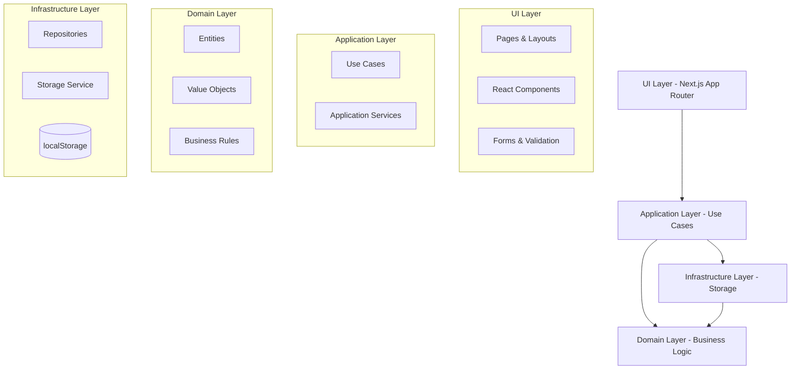

# Design Document

## Overview

This document outlines the technical design for a Next.js-based Product Management System that handles complex product variations and compositions. The system uses a clean architecture approach with domain-driven design principles, ensuring separation of concerns and maintainability. All data is persisted in localStorage with a robust repository pattern and schema versioning.

## Architecture

### High-Level Architecture



### Technology Stack

- **Frontend Framework:** Next.js 14+ with App Router
- **Language:** TypeScript (strict mode)
- **Styling:** Tailwind CSS + Shadcn UI components
- **Forms:** React Hook Form + Zod validation
- **Testing:** Vitest + React Testing Library + MSW
- **Code Quality:** ESLint + Prettier + Husky + lint-staged
- **Package Manager:** npm (documented for pnpm alternative)

### Directory Structure

```
├── app/                          # Next.js App Router
│   ├── (dashboard)/             # Route groups
│   │   ├── products/           # Product management pages
│   │   ├── variation-types/    # Variation type pages
│   │   └── variations/         # Variation pages
│   ├── globals.css             # Global styles
│   ├── layout.tsx              # Root layout
│   └── page.tsx                # Dashboard home
├── components/
│   ├── ui/                     # Shadcn UI components
│   └── shared/                 # Reusable components
│       ├── data-table/         # Generic table components
│       ├── forms/              # Form components
│       └── modals/             # Modal components
├── features/                   # Feature-based organization
│   ├── products/               # Product domain
│   │   ├── components/         # Product-specific UI
│   │   ├── domain/             # Business logic
│   │   ├── hooks/              # React hooks
│   │   └── services/           # Application services
│   ├── variation-types/        # Variation type domain
│   ├── variations/             # Variation domain
│   └── composition/            # Composition logic
├── lib/
│   ├── domain/                 # Core domain entities
│   │   ├── entities/           # Domain entities
│   │   ├── value-objects/      # Value objects
│   │   └── services/           # Domain services
│   ├── storage/                # Storage abstraction
│   │   ├── repositories/       # Repository implementations
│   │   ├── storage-service.ts  # localStorage wrapper
│   │   └── migrations/         # Schema migrations
│   ├── utils/                  # Utility functions
│   └── validations/            # Zod schemas
└── tests/                      # Test utilities and factories
    ├── factories/              # Test data factories
    ├── mocks/                  # MSW mocks
    └── setup.ts                # Test setup
```

## Components and Interfaces

### Domain Entities

#### Product Entity
```typescript
interface Product {
  sku: string;                    // Unique identifier
  name: string;                   // Product name
  dimensions?: Dimensions;        // Optional dimensions
  weight?: number;               // Optional weight (kg)
  isComposite: boolean;          // Composition flag
  hasVariation: boolean;         // Variation flag
  createdAt: Date;
  updatedAt: Date;
}

interface Dimensions {
  height: number;                // cm
  width: number;                 // cm  
  depth: number;                 // cm
}
```

#### Variation Type Entity
```typescript
interface VariationType {
  id: string;                    // UUID
  name: string;                  // Unique name (case-insensitive)
  modifiesWeight: boolean;       // Weight override flag
  modifiesDimensions: boolean;   // Dimension override flag
  createdAt: Date;
  updatedAt: Date;
}
```

#### Variation Entity
```typescript
interface Variation {
  id: string;                    // UUID
  variationTypeId: string;       // Foreign key
  name: string;                  // Unique within type (case-insensitive)
  createdAt: Date;
  updatedAt: Date;
}
```

#### Product Variation Item
```typescript
interface ProductVariationItem {
  id: string;                    // UUID
  productSku: string;            // Foreign key
  selections: Record<string, string>; // variationTypeId -> variationId
  weightOverride?: number;       // Override weight if type modifies
  dimensionsOverride?: Dimensions; // Override dimensions if type modifies
  createdAt: Date;
  updatedAt: Date;
}
```

#### Composition Item
```typescript
interface CompositionItem {
  id: string;                    // UUID
  parentSku: string;             // Parent product SKU
  childSku: string;              // Child product/variation SKU
  quantity: number;              // Positive integer
  createdAt: Date;
  updatedAt: Date;
}
```

### Repository Interfaces

```typescript
interface ProductRepository {
  findAll(): Promise<Product[]>;
  findBySku(sku: string): Promise<Product | null>;
  save(product: Product): Promise<void>;
  delete(sku: string): Promise<void>;
  exists(sku: string): Promise<boolean>;
}

interface VariationTypeRepository {
  findAll(): Promise<VariationType[]>;
  findById(id: string): Promise<VariationType | null>;
  save(variationType: VariationType): Promise<void>;
  delete(id: string): Promise<void>;
  findByName(name: string): Promise<VariationType | null>;
}

interface VariationRepository {
  findAll(): Promise<Variation[]>;
  findById(id: string): Promise<Variation | null>;
  findByTypeId(typeId: string): Promise<Variation[]>;
  save(variation: Variation): Promise<void>;
  delete(id: string): Promise<void>;
  findByNameAndType(name: string, typeId: string): Promise<Variation | null>;
}

interface ProductVariationRepository {
  findByProductSku(sku: string): Promise<ProductVariationItem[]>;
  save(item: ProductVariationItem): Promise<void>;
  delete(id: string): Promise<void>;
  findBySelections(sku: string, selections: Record<string, string>): Promise<ProductVariationItem | null>;
}

interface CompositionRepository {
  findByParentSku(parentSku: string): Promise<CompositionItem[]>;
  save(item: CompositionItem): Promise<void>;
  delete(id: string): Promise<void>;
  findByChildSku(childSku: string): Promise<CompositionItem[]>;
}
```

### Application Services

#### Product Service
```typescript
class ProductService {
  async createProduct(data: CreateProductData): Promise<Product>;
  async updateProduct(sku: string, data: UpdateProductData): Promise<Product>;
  async deleteProduct(sku: string): Promise<void>;
  async getProduct(sku: string): Promise<Product>;
  async getAllProducts(): Promise<Product[]>;
  async validateProductConstraints(product: Product): Promise<ValidationResult>;
}
```

#### Variation Service
```typescript
class VariationService {
  async generateCombinations(productSku: string, typeIds: string[]): Promise<ProductVariationItem[]>;
  async validateCombinationUniqueness(item: ProductVariationItem): Promise<boolean>;
  async calculateEffectiveWeight(product: Product, selections?: Record<string, string>): Promise<number>;
  async calculateEffectiveDimensions(product: Product, selections?: Record<string, string>): Promise<Dimensions>;
}
```

#### Composition Service
```typescript
class CompositionService {
  async addCompositionItem(parentSku: string, childSku: string, quantity: number): Promise<void>;
  async removeCompositionItem(itemId: string): Promise<void>;
  async calculateCompositeWeight(parentSku: string, selections?: Record<string, string>): Promise<number>;
  async validateCompositionConstraints(parentSku: string): Promise<ValidationResult>;
  async getAvailableChildProducts(): Promise<Product[]>; // Excludes variable parents
}
```

## Data Models

### Storage Schema

```typescript
interface StorageSchema {
  schemaVersion: number;
  products: Record<string, Product>;                    // SKU -> Product
  variationTypes: Record<string, VariationType>;        // ID -> VariationType
  variations: Record<string, Variation>;                // ID -> Variation
  productVariations: Record<string, ProductVariationItem>; // ID -> ProductVariationItem
  compositions: Record<string, CompositionItem>;        // ID -> CompositionItem
  metadata: {
    lastUpdated: Date;
    totalProducts: number;
    totalVariationTypes: number;
    totalVariations: number;
  };
}
```

### Storage Keys
- `poc:meta` - Schema version and metadata
- `poc:products` - Product entities
- `poc:variation-types` - Variation type entities  
- `poc:variations` - Variation entities
- `poc:product-variations` - Product variation combinations
- `poc:compositions` - Composition items

### Migration Strategy

```typescript
interface Migration {
  version: number;
  description: string;
  up: (data: any) => any;
  down: (data: any) => any;
}

const migrations: Migration[] = [
  {
    version: 1,
    description: "Initial schema",
    up: (data) => ({ ...data, schemaVersion: 1 }),
    down: (data) => data
  },
  {
    version: 2, 
    description: "Add case-insensitive uniqueness",
    up: (data) => normalizeNames(data),
    down: (data) => data
  }
];
```

## Error Handling

### Error Types

```typescript
class ValidationError extends Error {
  constructor(
    message: string,
    public field: string,
    public code: string
  ) {
    super(message);
  }
}

class BusinessRuleError extends Error {
  constructor(
    message: string,
    public rule: string,
    public context?: any
  ) {
    super(message);
  }
}

class StorageError extends Error {
  constructor(
    message: string,
    public operation: string,
    public cause?: Error
  ) {
    super(message);
  }
}
```

### Error Handling Strategy

1. **Domain Layer:** Throws business rule violations as `BusinessRuleError`
2. **Application Layer:** Catches domain errors and converts to user-friendly messages
3. **UI Layer:** Displays errors using toast notifications and form field errors
4. **Storage Layer:** Handles localStorage failures gracefully with fallbacks

### Validation Rules

```typescript
// Zod schemas for validation
const ProductSchema = z.object({
  sku: z.string().min(1).max(50).regex(/^[A-Z0-9-]+$/),
  name: z.string().min(1).max(100),
  dimensions: z.object({
    height: z.number().positive(),
    width: z.number().positive(), 
    depth: z.number().positive()
  }).optional(),
  weight: z.number().positive().optional(),
  isComposite: z.boolean(),
  hasVariation: z.boolean()
});

const VariationTypeSchema = z.object({
  name: z.string().min(1).max(50),
  modifiesWeight: z.boolean(),
  modifiesDimensions: z.boolean()
});
```

## Testing Strategy

### Test Pyramid

1. **Unit Tests (70%)**
   - Domain entities and business rules
   - Repository implementations with mocked storage
   - Utility functions and calculations
   - Form validation logic

2. **Integration Tests (20%)**
   - Application services with real repositories
   - Component integration with forms and validation
   - Storage operations with localStorage

3. **End-to-End Tests (10%)**
   - Critical user journeys
   - Complex workflows (composite + variation)
   - Cross-feature interactions

### Test Organization

```typescript
// Test factories
export const makeProduct = (overrides?: Partial<Product>): Product => ({
  sku: 'TEST-001',
  name: 'Test Product',
  isComposite: false,
  hasVariation: false,
  createdAt: new Date(),
  updatedAt: new Date(),
  ...overrides
});

export const makeVariationType = (overrides?: Partial<VariationType>): VariationType => ({
  id: uuid(),
  name: 'Color',
  modifiesWeight: false,
  modifiesDimensions: false,
  createdAt: new Date(),
  updatedAt: new Date(),
  ...overrides
});
```

### Coverage Requirements

- **Statements:** ≥90%
- **Lines:** ≥90%  
- **Branches:** ≥90%
- **Functions:** ≥90%

### Test Configuration

```typescript
// vitest.config.ts
export default defineConfig({
  test: {
    environment: 'jsdom',
    setupFiles: ['./tests/setup.ts'],
    coverage: {
      provider: 'v8',
      reporter: ['text', 'html', 'lcov'],
      thresholds: {
        statements: 90,
        branches: 90,
        functions: 90,
        lines: 90
      }
    }
  }
});
```

## Performance Considerations

### Optimization Strategies

1. **Memoization**
   - Cache calculated weights and dimensions
   - Memoize expensive combination generations
   - Cache repository queries within component lifecycle

2. **Lazy Loading**
   - Load variation data only when needed
   - Paginate large product lists
   - Defer composition calculations until required

3. **Efficient Algorithms**
   - Optimized cartesian product generation
   - Indexed lookups for uniqueness validation
   - Batch operations for multiple updates

4. **UI Performance**
   - Virtual scrolling for large tables
   - Debounced search inputs
   - Skeleton loading states
   - Optimistic updates with rollback

### Memory Management

```typescript
// Efficient combination generation
function* generateCombinations(
  variationTypes: VariationType[],
  variations: Record<string, Variation[]>
): Generator<Record<string, string>> {
  // Generator to avoid loading all combinations in memory
  // Yields combinations one at a time
}

// Indexed storage for fast lookups
class IndexedRepository<T> {
  private cache = new Map<string, T>();
  private indexes = new Map<string, Set<string>>();
  
  // Efficient uniqueness checks using indexes
  async isUnique(field: string, value: string): Promise<boolean> {
    return !this.indexes.get(field)?.has(value.toLowerCase());
  }
}
```

## Security Considerations

### Data Validation

1. **Input Sanitization**
   - Zod schema validation on all inputs
   - XSS prevention in product names and descriptions
   - SQL injection prevention (though using localStorage)

2. **Business Rule Enforcement**
   - Server-side validation of all business rules
   - Referential integrity checks
   - Constraint validation before persistence

### localStorage Security

1. **Data Integrity**
   - Schema validation on load
   - Checksum validation for critical data
   - Graceful handling of corrupted data

2. **Size Limits**
   - Monitor localStorage usage
   - Implement data cleanup strategies
   - Warn users of storage limits

## Accessibility Features

### WCAG 2.1 AA Compliance

1. **Keyboard Navigation**
   - Tab order management
   - Focus indicators
   - Keyboard shortcuts for common actions

2. **Screen Reader Support**
   - Semantic HTML structure
   - ARIA labels and descriptions
   - Live regions for dynamic updates

3. **Visual Accessibility**
   - High contrast color scheme
   - Scalable text and UI elements
   - Clear visual hierarchy

### Implementation Examples

```typescript
// Accessible form components
const AccessibleInput = ({ label, error, ...props }) => (
  <div>
    <label htmlFor={props.id} className="sr-only md:not-sr-only">
      {label}
    </label>
    <input
      {...props}
      aria-invalid={!!error}
      aria-describedby={error ? `${props.id}-error` : undefined}
    />
    {error && (
      <div id={`${props.id}-error`} role="alert" className="text-red-600">
        {error}
      </div>
    )}
  </div>
);

// Accessible data tables
const AccessibleTable = ({ data, columns }) => (
  <table role="table" aria-label="Product list">
    <thead>
      <tr>
        {columns.map(col => (
          <th key={col.key} scope="col" aria-sort={col.sortDirection}>
            {col.label}
          </th>
        ))}
      </tr>
    </thead>
    <tbody>
      {data.map(row => (
        <tr key={row.id}>
          {columns.map(col => (
            <td key={col.key}>{row[col.key]}</td>
          ))}
        </tr>
      ))}
    </tbody>
  </table>
);
```

## Deployment and Build Configuration

### Build Optimization

```typescript
// next.config.js
const nextConfig = {
  experimental: {
    typedRoutes: true,
  },
  compiler: {
    removeConsole: process.env.NODE_ENV === 'production',
  },
  webpack: (config) => {
    config.optimization.splitChunks = {
      chunks: 'all',
      cacheGroups: {
        vendor: {
          test: /[\\/]node_modules[\\/]/,
          name: 'vendors',
          chunks: 'all',
        },
      },
    };
    return config;
  },
};
```

### Environment Configuration

```typescript
// Environment variables
interface EnvironmentConfig {
  NODE_ENV: 'development' | 'production' | 'test';
  NEXT_PUBLIC_APP_VERSION: string;
  NEXT_PUBLIC_STORAGE_PREFIX: string;
  NEXT_PUBLIC_DEBUG_MODE: boolean;
}
```

This design provides a solid foundation for implementing the complex product management system while maintaining clean architecture principles, comprehensive testing, and excellent user experience.